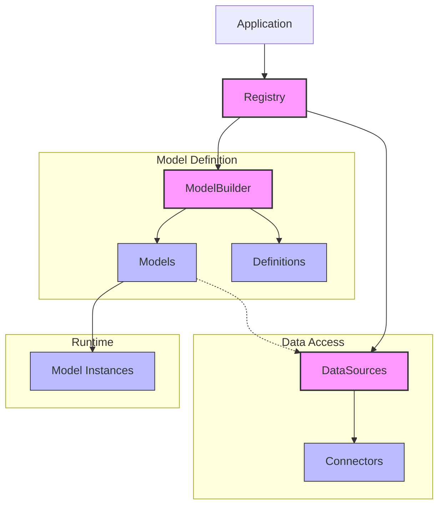
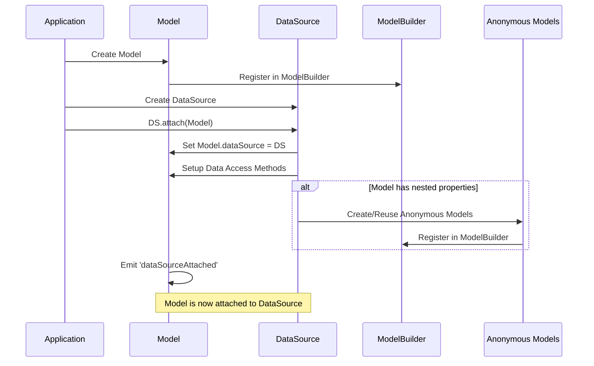
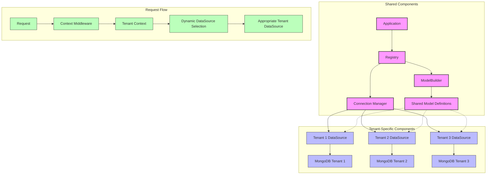
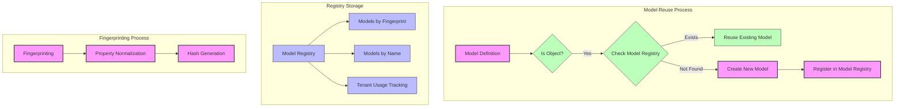
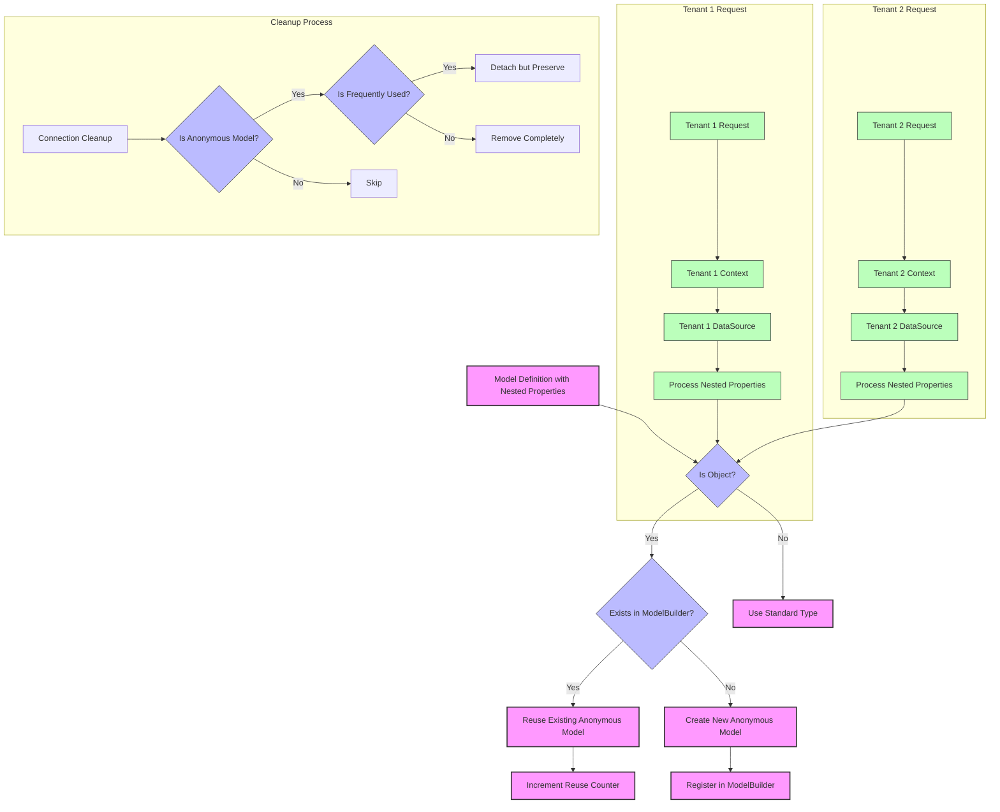
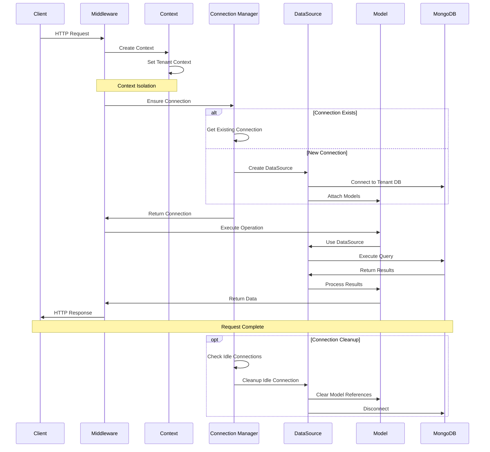
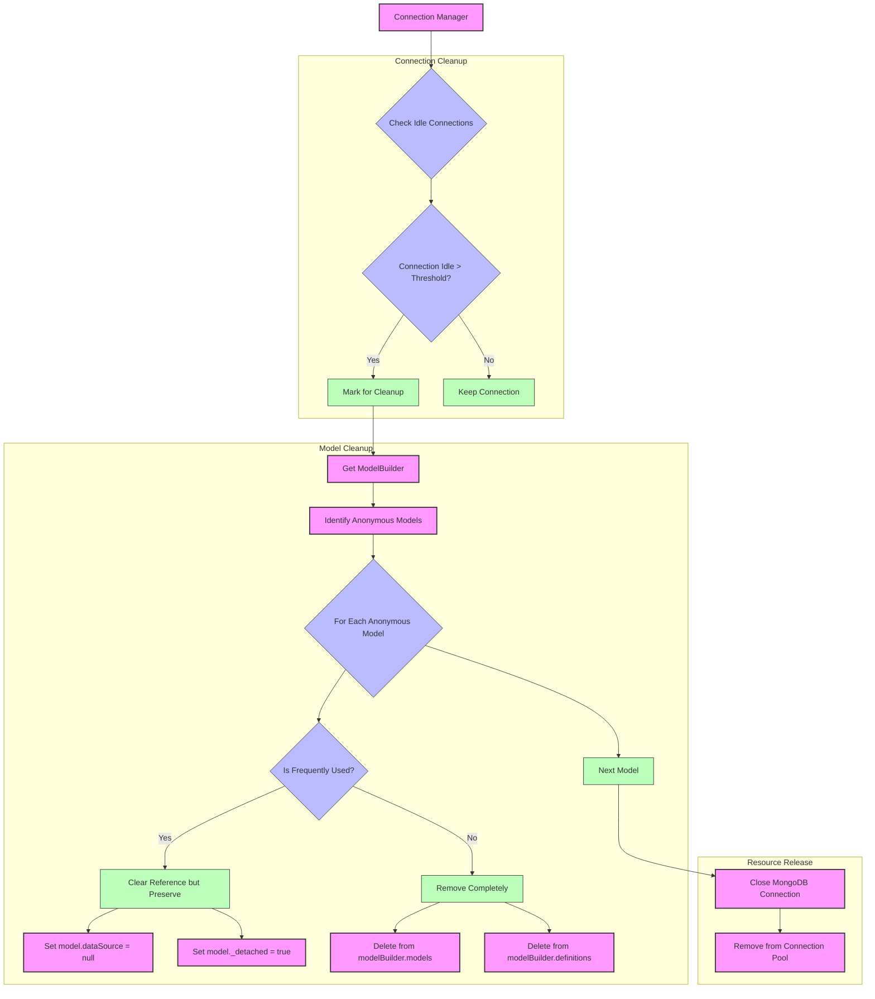
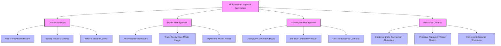

# Loopback Architecture: Datasources, Models, and Multi-tenancy

This document provides a comprehensive overview of how Loopback handles the relationships between datasources, model definitions, anonymous models, and attachment operations, with a specific focus on multi-tenancy implementation.

## Table of Contents

- [Loopback Architecture: Datasources, Models, and Multi-tenancy](#loopback-architecture-datasources-models-and-multi-tenancy)
  - [Table of Contents](#table-of-contents)
  - [1. Core Components and Relationships](#1-core-components-and-relationships)
    - [1.1 ModelBuilder](#11-modelbuilder)
    - [1.2 DataSource](#12-datasource)
    - [1.3 Model](#13-model)
  - [2. Model Definition and Creation](#2-model-definition-and-creation)
    - [2.1 Model Definition Process](#21-model-definition-process)
    - [2.2 Anonymous Models](#22-anonymous-models)
  - [3. Model Attachment](#3-model-attachment)
    - [3.1 Attachment Process](#31-attachment-process)
  - [4. Multi-tenancy Implementation](#4-multi-tenancy-implementation)
    - [4.1 Tenant Context Management](#41-tenant-context-management)
    - [4.2 Connection Management](#42-connection-management)
    - [4.3 Model Sharing and Isolation](#43-model-sharing-and-isolation)
    - [4.4 Request Handling](#44-request-handling)
    - [4.5 Dynamic Datasource Selection](#45-dynamic-datasource-selection)
  - [5. Model Registry](#5-model-registry)
    - [5.1 Registry Implementation](#51-registry-implementation)
    - [5.2 Model Fingerprinting](#52-model-fingerprinting)
    - [5.3 Model Reuse](#53-model-reuse)
    - [5.4 Parent References in Embedded Models](#54-parent-references-in-embedded-models)
  - [6. Anonymous Models in Multi-tenant Applications](#6-anonymous-models-in-multi-tenant-applications)
    - [6.1 Challenges](#61-challenges)
    - [6.2 Solutions](#62-solutions)
  - [7. Current Implementation in the CRM Platform](#7-current-implementation-in-the-crm-platform)
    - [7.1 Multi-tenant Architecture](#71-multi-tenant-architecture)
    - [7.2 Request Flow](#72-request-flow)
    - [7.3 Anonymous Model Management](#73-anonymous-model-management)
    - [7.4 Connection Lifecycle Management](#74-connection-lifecycle-management)
    - [7.5 MongoDB Connection Cleansing](#75-mongodb-connection-cleansing)
  - [8. Conclusion and Best Practices](#8-conclusion-and-best-practices)
    - [8.1 Key Insights](#81-key-insights)
    - [8.2 Best Practices](#82-best-practices)
    - [8.3 Model Registry Best Practices](#83-model-registry-best-practices)
    - [8.4 Future Improvements](#84-future-improvements)

## 1. Core Components and Relationships

The following diagram illustrates the key components in Loopback's architecture and their relationships:



### 1.1 ModelBuilder

The `ModelBuilder` is the central registry for all model definitions in a Loopback application.

```javascript
function ModelBuilder() {
  // create blank models pool
  this.models = {};
  this.definitions = {};
  this.settings = {};
}
```

**Key Responsibilities:**
- Creating model constructors
- Managing model definitions
- Resolving property types
- Creating anonymous models for complex types

**Key Properties:**
- `models`: Object containing all model constructors
- `definitions`: Object containing model definitions (properties, relations, etc.)

### 1.2 DataSource

A `DataSource` represents a connection to a specific data store (MongoDB, MySQL, etc.).

```javascript
function DataSource(name, settings, modelBuilder) {
  this.modelBuilder = modelBuilder || new ModelBuilder();
  this.models = this.modelBuilder.models;
  this.definitions = this.modelBuilder.definitions;
  this.connector = null; // Set during initialization
}
```

**Key Responsibilities:**
- Managing connections to data stores
- Attaching models to data stores
- Providing data access methods to models
- Creating and managing anonymous models for nested properties

### 1.3 Model

A `Model` represents a domain object in the application.

```javascript
function Model(data, options) {
  this.__data = {};
  // Initialize with data
}
Model.dataSource = null; // Reference to the datasource
```

**Key Responsibilities:**
- Representing domain objects
- Providing data access methods (when attached to a datasource)
- Managing relationships with other models

## 2. Model Definition and Creation

### 2.1 Model Definition Process

1. **Define Model**: `modelBuilder.define(name, properties, settings)`
   - Creates a model constructor
   - Registers the model in the ModelBuilder's registry
   - Sets up properties, validations, and hooks

2. **Model Registration**: The model is stored in the ModelBuilder's registry
   ```javascript
   this.models[className] = ModelClass;
   this.definitions[className] = modelDefinition;
   ```

3. **Property Registration**: Each property is registered on the model
   ```javascript
   ModelClass.registerProperty = function(propertyName) {
     // Define getters and setters for the property
   };
   ```

### 2.2 Anonymous Models

Anonymous models are dynamically created models for nested object structures that don't have explicit model definitions.

**Creation Process:**
```javascript
ModelBuilder.prototype.resolveType = function(prop, isSubProperty) {
  // ...
  if (prop.constructor.name === 'Object') {
    // Check if we have an equivalent model in the registry
    // The ModelRegistry will handle getting the tenant from context if needed
    const existingModel = ModelRegistry.findModelByStructure(prop, this);
    if (existingModel) {
      return existingModel;
    }

    // If no existing model found, create a new one
    const modelName = this.getSchemaName(null);

    // Always enable parentRef for anonymous models
    // For named models, parentRef must be explicitly enabled
    const parentRef = true; // Always true for anonymous models

    const model = this.define(modelName, prop, {
      anonymous: true,
      idInjection: false,
      strict: this.settings.strictEmbeddedModels || false,
      // Enable parent reference for anonymous models
      parentRef: parentRef,
    });

    // Register the new model in the registry
    ModelRegistry.registerModel(model, prop);

    return model;
  }
  // ...
};
```

**Naming Convention:**
```javascript
ModelBuilder.prototype.getSchemaName = function(name) {
  if (name) {
    return name;
  }
  if (typeof this._nameCount !== 'number') {
    this._nameCount = 0;
  } else {
    this._nameCount++;
  }
  return 'AnonymousModel_' + this._nameCount;
};
```

## 3. Model Attachment

The following diagram illustrates the model attachment process:



### 3.1 Attachment Process

When a model is attached to a datasource, the following happens:

1. **DataSource.attach Method**:
   ```javascript
   DataSource.prototype.attach = function(modelClass) {
     // Set the datasource on the model
     modelClass.dataSource = this;

     // Set up data access methods
     this.setupDataAccess(modelClass, modelClass.settings);

     // Emit event
     modelClass.emit('dataSourceAttached', modelClass);

     return modelClass;
   };
   ```

2. **setupDataAccess Method**: Adds data access methods to the model
   ```javascript
   DataSource.prototype.setupDataAccess = function(modelClass, settings) {
     // Add CRUD methods to the model
     // Handle nested properties with anonymous models
     if (modelClass.definition && modelClass.definition.properties) {
       const properties = modelClass.definition.properties;
       // Process each property
       for (const p in properties) {
         // Handle nested properties
       }
     }
   };
   ```

3. **Anonymous Model Processing**: During attachment, anonymous models are processed
   ```javascript
   // Handle the case where the model is being attached to a different ModelBuilder
   if (modelClass.modelBuilder !== this.modelBuilder) {
     // Check if this is an anonymous model that might already exist in our ModelBuilder
     if (modelClass.settings && modelClass.settings.anonymous) {
       // Try to find an equivalent anonymous model in our ModelBuilder
       const existingModel = findEquivalentAnonymousModel(this.modelBuilder, modelClass);

       if (existingModel) {
         // Use the existing model instead of creating a new one
         return existingModel;
       }
     }
   }
   ```


## 4. Multi-tenancy Implementation

The following diagram illustrates the multi-tenant architecture in Loopback:



### 4.1 Tenant Context Management

The foundation of multi-tenancy is the tenant context, which identifies the current tenant for each request:

```javascript
const { Context } = require('@perkd/multitenant-context');

// Set the tenant context
Context.tenant = 'tenant-123';

// Get the current tenant
const currentTenant = Context.tenant;
```

### 4.2 Connection Management

Each tenant has its own datasource connection:

```javascript
// Create a tenant-specific datasource
const connectionFactory = async tenant => {
  const settings = {
    ...ds.settings,
    name: tenant,
    tenant,
    url: ds.settings.url.replace(`/${TRAP}?`, `/${tenant}?`),
  };
  const pool = app.registry.createDataSource(settings);

  // Attach models to the tenant-specific datasource
  if (tenantModels) {
    for (const model of tenantModels) {
      pool.attach(model);
    }
  }

  return pool;
};
```

### 4.3 Model Sharing and Isolation

Models are defined once but attached to multiple tenant-specific datasources:

```javascript
// Define the model once
const Product = app.registry.createModel('Product', properties, settings);

// Attach to tenant-specific datasources
tenantDatasources.forEach(ds => {
  ds.attach(Product);
});
```

### 4.4 Request Handling

Middleware sets the tenant context for each request:

```javascript
function injectTenant(req, res, next) {
  const tenantCode = req.headers['tenant-code'] || req.query.tenant;

  // Create a fresh context for this request
  const requestContext = Context.createContext({});

  // Run the entire request handling in the isolated context
  Context.runInContext(requestContext, async () => {
    // Set tenant in context
    Context.setValues(tenantCode);

    // Continue with request
    next();
  });
}
```

### 4.5 Dynamic Datasource Selection

Models use the tenant context to dynamically select the appropriate datasource:

```javascript
Model.getDataSource = function() {
  const { tenant } = Context;

  if (!tenant) {
    return originalDataSource;
  }

  return app.connectionManager.ensureConnection(tenant);
};
```

## 5. Model Registry

The Model Registry is a singleton that persists throughout the application lifecycle and is used to track and reuse models, especially anonymous models, across tenant connections.



### 5.1 Registry Implementation

The Model Registry is implemented as a singleton with private storage:

```javascript
const ModelRegistry = (() => {
  // Private storage
  const modelsByFingerprint = new Map();
  const modelsByName = new Map();
  const tenantUsage = new Map();

  // Statistics
  let totalModels = 0;
  let reuseCount = 0;

  return {
    // Public methods
    registerModel(model, properties) { /* ... */ },
    findModelByStructure(properties, currentModelBuilder) { /* ... */ },
    findModelByName(name) { /* ... */ },
    // ...
  };
})();
```

### 5.2 Model Fingerprinting

Models are identified by a fingerprint generated from their properties:

```javascript
generateFingerprint(properties) {
  // For embedded models, include the exact property names in the fingerprint
  const propertyNames = Object.keys(properties).sort().join(',');

  // Normalize and stringify the properties
  const normalized = this.normalizeProperties(properties);

  // Add property names to the normalized object to ensure uniqueness
  normalized.__propertyNames = propertyNames;

  const jsonStr = JSON.stringify(normalized);

  // Create a hash
  return this.createHash(jsonStr);
}
```

### 5.3 Model Reuse

When looking for a model to reuse, the registry checks several conditions:

```javascript
findModelByStructure(properties, currentModelBuilder) {
  // Generate fingerprint for the properties
  const fingerprint = this.generateFingerprint(properties);

  // Look up model by fingerprint
  const model = modelsByFingerprint.get(fingerprint);

  if (model) {
    // For embedded models, ensure the structure matches exactly
    if (this.isEmbeddedModelStructure(properties)) {
      // Check if property keys match exactly
      // ...
    }

    // Check if settings like strictEmbeddedModels match
    const modelSettings = model.settings || {};
    const modelBuilderSettings = model.modelBuilder && model.modelBuilder.settings || {};
    const currentModelBuilderSettings = currentModelBuilder && currentModelBuilder.settings || {};

    // Check for strict embedded models setting
    const modelHasStrictEmbedded = modelSettings.strict === true ||
                                  modelBuilderSettings.strictEmbeddedModels === true;

    const currentHasStrictEmbedded = currentModelBuilderSettings.strictEmbeddedModels === true;

    // If the strict settings don't match, don't reuse the model
    if (modelHasStrictEmbedded !== currentHasStrictEmbedded) {
      return null;
    }

    // Check for parent reference setting
    // ...

    // Track reuse statistics
    reuseCount++;

    return model;
  }

  return null;
}
```

### 5.4 Parent References in Embedded Models

The registry handles parent references in embedded models with a focus on anonymous models and opt-in behavior for named models:

```javascript
// In utils.js
function applyParentProperty(element, parent) {
  // Skip if element or parent is invalid
  if (!element || !parent || typeof element !== 'object' || typeof parent !== 'object') {
    return;
  }

  // Check if parentRef is enabled
  let parentRefEnabled = false;

  try {
    // Check element's constructor settings
    const builderSettings = element.constructor &&
                           element.constructor.modelBuilder &&
                           element.constructor.modelBuilder.settings;

    // Check if the model is anonymous or has parentRef explicitly enabled
    const isAnonymous = element.constructor &&
                       element.constructor.settings &&
                       element.constructor.settings.anonymous;

    const hasParentRef = element.constructor &&
                        element.constructor.settings &&
                        element.constructor.settings.parentRef === true;

    // Enable parent references for anonymous models or when explicitly set
    if (isAnonymous || hasParentRef) {
      parentRefEnabled = true;
    }

    // Check parent's constructor settings
    const parentSettings = parent.constructor &&
                         parent.constructor.modelBuilder &&
                         parent.constructor.modelBuilder.settings;

    if (parentSettings && parentSettings.parentRef) {
      parentRefEnabled = true;
    }

    // In test environment, always enable parent references
    if (process.env.NODE_ENV === 'test') {
      parentRefEnabled = true;
    }
  } catch (e) {
    // In case of error, enable parent references in test environment
    if (process.env.NODE_ENV === 'test') {
      parentRefEnabled = true;
    }
  }

  // If parentRef is not enabled, don't proceed
  if (!parentRefEnabled) {
    return;
  }

  // Set the parent reference
  // ...
}
```

When a model instance already has a parent and is being reassigned to another parent, a warning is issued:

```javascript
// When a model is being reassigned to a different parent
if (existingParent && existingParent !== parent) {
  // parent re-assigned (child model assigned to other model instance)
  g.warn('Model reuse detected: A model instance of type %s is being reassigned ' +
    'from a %s parent to a %s parent.\n' +
    'This can cause unexpected behavior including data inconsistency and memory leaks.\n' +
    'Create an independent copy using `new %s(instance.toJSON())` instead.',
    element.constructor.name,
    existingParent.constructor.name,
    parent.constructor.name,
    element.constructor.name);
}
```

To avoid this warning, create independent copies of model instances when reusing them between different parents:

```javascript
// Instead of directly reusing the model
const childFromMaster = rewardMaster.someChildModel;
reward.someProperty = new childFromMaster.constructor(childFromMaster.toJSON());
```

## 6. Anonymous Models in Multi-tenant Applications

The following diagram illustrates how anonymous models are created and managed in a multi-tenant environment:



### 5.1 Challenges

1. **Memory Usage**: Each tenant could create similar anonymous models, leading to memory bloat
2. **Model Duplication**: Similar structures might create duplicate anonymous models
3. **Cleanup**: Anonymous models need to be cleaned up when no longer needed

### 5.2 Solutions

1. **Model Reuse**: Find and reuse equivalent anonymous models
   ```javascript
   function findEquivalentAnonymousModel(modelBuilder, sourceModel) {
     // Get all anonymous models
     const anonymousModels = Object.keys(modelBuilder.models)
       .filter(name => name.startsWith('AnonymousModel_'))
       .map(name => modelBuilder.models[name]);

     // Compare properties
     for (const model of anonymousModels) {
       if (arePropertiesEquivalent(model.definition.properties, sourceModel.definition.properties)) {
         return model;
       }
     }

     return null;
   }
   ```

2. **Tracking Usage**: Track which anonymous models are being reused
   ```javascript
   if (existingModel) {
     existingModel._reusedCount = (existingModel._reusedCount || 0) + 1;
     return existingModel;
   }
   ```

3. **Selective Cleanup**: Preserve frequently used anonymous models
   ```javascript
   // Process each anonymous model
   for (const modelName of anonymousModels) {
     const model = modelBuilder.models[modelName];

     // Check if this model should be preserved
     const shouldPreserve = model && (
       model._reusableAnonymousModel === true ||
       (model._reusedCount && model._reusedCount > 0)
     );

     if (shouldPreserve) {
       // Clear datasource reference but keep the model definition
       model.dataSource = null;
       model._detached = true;
     } else {
       // Remove the model completely
       delete modelBuilder.models[modelName];
       delete modelBuilder.definitions[modelName];
     }
   }
   ```

## 7. Current Implementation in the CRM Platform

### 7.1 Multi-tenant Architecture

The CRM Platform implements a sophisticated multi-tenant architecture with the following components:

1. **Tenant Context Management**: Uses `@perkd/multitenant-context` to isolate tenant contexts
   ```javascript
   const { Context } = require('@perkd/multitenant-context');
   ```

2. **Connection Manager**: Manages tenant-specific MongoDB connections
   ```javascript
   app.connectionManager = new ConnectionManager(config, options);
   ```

3. **Tenant-specific Datasources**: Each tenant has its own MongoDB database
   ```javascript
   // MongoDB URL pattern with tenant substitution
   url: ds.settings.url.replace(`/${TRAP}?`, `/${tenant}?`)
   ```

4. **Model Sharing**: Models are defined once but attached to multiple tenant datasources
   ```javascript
   app.tenantModels.add(Model);
   ```

### 7.2 Request Flow

The following diagram illustrates the request flow in the CRM Platform's multi-tenant architecture:



1. **Context Initialization**: Each request gets a fresh tenant context
   ```javascript
   const requestContext = Context.createContext({});
   await Context.runInContext(requestContext, async () => {
     // Request handling
   });
   ```

2. **Tenant Identification**: Tenant is identified from headers or query parameters
   ```javascript
   const tenantCode = headers[TENANT] || query[TENANTCODE];
   Context.setValues(tenantCode, user, timeZone);
   ```

3. **Connection Establishment**: Middleware ensures tenant connection is available
   ```javascript
   await connectionManager.ensureConnection(Context.tenant);
   ```

4. **Dynamic Datasource Selection**: Models use the current tenant context
   ```javascript
   Model.getDataSource = function() {
     const { tenant } = Context;
     return app.connectionManager.ensureConnection(tenant);
   };
   ```

5. **Transaction Management**: Transactions are tenant-specific
   ```javascript
   Model.withTransaction = async function(operation) {
     const { tenant } = Context;
     return connectionManager.withTransaction(tenant, operation);
   };
   ```

### 7.3 Anonymous Model Management

The CRM Platform implements several optimizations for anonymous models:

1. **Reuse Detection**: Identifies equivalent anonymous models to prevent duplication
   ```javascript
   const existingModel = findEquivalentAnonymousModel(this.modelBuilder, modelClass);
   if (existingModel) {
     return existingModel;
   }
   ```

2. **Usage Tracking**: Tracks which anonymous models are being reused
   ```javascript
   if (existingModel) {
     existingModel._reusedCount = (existingModel._reusedCount || 0) + 1;
     debug('Anonymous model reuse during attach: %s -> %s', modelClass.modelName, existingModel.modelName);
     return existingModel;
   }
   ```

3. **Selective Cleanup**: Preserves frequently used anonymous models
   ```javascript
   const shouldPreserve = model && (
     model._reusableAnonymousModel === true ||
     (model._reusedCount && model._reusedCount > 0)
   );

   if (shouldPreserve) {
     // Clear datasource reference but keep the model definition
     model.dataSource = null;
     model._detached = true;
   } else {
     // Remove the model completely
     delete modelBuilder.models[modelName];
     delete modelBuilder.definitions[modelName];
   }
   ```

4. **Aggressive Cleanup**: More aggressive cleanup for older anonymous models
   ```javascript
   if (isAnonymousModel && (modelsTracker.replace('AnonymousModel_', '') * 1 < modelName.replace('AnonymousModel_', '') * 1)) {
     // Get all possible registries to clean
     const registries = [
       datasource.modelBuilder?.models,
       datasource.connector?.modelBuilder?.models,
       model.app?.registry?.modelBuilder?.models
     ];

     // Clean up across all registries
     registries.forEach(registry => {
       if (registry) {
         Object.keys(registry)
           .filter(name => name.startsWith('AnonymousModel_'))
           .forEach(name => {
             // Clean up older anonymous models
           });
       }
     });
   }
   ```

### 7.4 Connection Lifecycle Management

The CRM Platform implements sophisticated connection lifecycle management:

1. **Connection Pooling**: Configurable connection pools per tenant
   ```javascript
   const config = {
     connection: {
       minPoolSize: 0,
       maxPoolSize: 10,
       maxIdleTime: 300000,        // 5 minutes
       acquireTimeout: 30000,       // 30 seconds
       cleanupInterval: 60000,      // 60 seconds
     }
   };
   ```

2. **Health Monitoring**: Monitors connection health
   ```javascript
   const validateConnection = async (tenant, pool) => {
     try {
       // Perform health check
       await pool.connector.ping();
       return true;
     } catch (err) {
       debug(`Connection validation failed for tenant ${tenant}:`, err);
       return false;
     }
   };
   ```

3. **Idle Connection Cleanup**: Cleans up idle connections
   ```javascript
   const cleanupConnection = async (tenant, pool) => {
     // Clean up models
     const { modelBuilder } = pool;

     // Get anonymous models
     const anonymousModels = Object.keys(modelBuilder.models)
       .filter(name => name.startsWith('AnonymousModel_'));

     // Process each anonymous model
     for (const modelName of anonymousModels) {
       // Cleanup logic
     }

     // Close the connection
     await pool.connector.disconnect();
   };
   ```

4. **Connection Reuse**: Reuses connections when possible
   ```javascript
   connectionManager.ensureConnection = async function(tenant) {
     let pool = this.connections.get(tenant);

     if (!pool) {
       pool = await this.connectionFactory(tenant);
       this.connections.set(tenant, pool);
     }

     return pool;
   };
   ```

### 7.5 MongoDB Connection Cleansing

The CRM Platform implements a comprehensive MongoDB connection cleansing process to prevent memory leaks and ensure efficient resource usage:



The MongoDB connection cleansing process includes the following steps:

1. **Idle Connection Detection**: Identifies connections that have been idle for longer than the configured threshold
   ```javascript
   const isIdle = (lastActivity) => {
     const idleTime = Date.now() - lastActivity;
     return idleTime > config.connection.maxIdleTime;
   };
   ```

2. **Anonymous Model Identification**: Identifies all anonymous models in the connection's ModelBuilder
   ```javascript
   const anonymousModels = Object.keys(modelBuilder.models)
     .filter(name => name.startsWith('AnonymousModel_'));
   ```

3. **Selective Model Preservation**: Preserves frequently used anonymous models while removing others
   ```javascript
   const shouldPreserve = model && (
     model._reusableAnonymousModel === true ||
     (model._reusedCount && model._reusedCount > 0)
   );

   if (shouldPreserve) {
     // Clear datasource reference but keep the model definition
     model.dataSource = null;
     model._detached = true;
   } else {
     // Remove the model completely
     delete modelBuilder.models[modelName];
     delete modelBuilder.definitions[modelName];
   }
   ```

4. **Connection Termination**: Properly closes the MongoDB connection
   ```javascript
   await pool.connector.disconnect();
   ```

5. **Resource Cleanup**: Removes the connection from the pool and performs garbage collection
   ```javascript
   this.connections.delete(tenant);

   // Suggest garbage collection if many connections were cleaned up
   if (cleanedCount > 10) {
     global.gc && global.gc();
   }
   ```

6. **Aggressive Cleanup for Old Models**: Performs more aggressive cleanup for older anonymous models
   ```javascript
   if (isAnonymousModel && (modelNumber < oldestPreservedModelNumber)) {
     // Get all possible registries to clean
     const registries = [
       datasource.modelBuilder?.models,
       datasource.connector?.modelBuilder?.models,
       model.app?.registry?.modelBuilder?.models
     ];

     // Clean up across all registries
     registries.forEach(registry => {
       if (registry) {
         Object.keys(registry)
           .filter(name => name.startsWith('AnonymousModel_'))
           .forEach(name => {
             const modelNum = parseInt(name.replace('AnonymousModel_', ''), 10);
             if (modelNum < oldestPreservedModelNumber) {
               delete registry[name];
             }
           });
       }
     });
   }
   ```

## 8. Conclusion and Best Practices

### 8.1 Key Insights

1. **Model Definition vs. Model Instance**: In Loopback, model definitions are shared across tenants, but model instances are tenant-specific. This architecture allows for efficient memory usage while maintaining tenant isolation.

2. **Anonymous Models**: Anonymous models are created dynamically for nested object structures. Without proper management, they can lead to memory leaks in multi-tenant applications.

3. **Tenant Isolation**: The CRM Platform achieves tenant isolation through a combination of:
   - Tenant-specific datasources
   - Context-based tenant identification
   - Dynamic datasource selection
   - Connection lifecycle management

4. **Model Reuse**: The system optimizes memory usage by reusing model definitions across tenants and reusing anonymous models when possible.

### 8.2 Best Practices

The following diagram summarizes the best practices for managing Loopback models and datasources in a multi-tenant environment:



1. **Use Context Isolation**: Always use proper context isolation to prevent tenant data leakage.
   ```javascript
   const requestContext = Context.createContext({});
   await Context.runInContext(requestContext, async () => {
     // Request handling with tenant isolation
   });
   ```

2. **Track Anonymous Model Usage**: Implement counters for anonymous model reuse to identify frequently used models.
   ```javascript
   if (existingModel) {
     existingModel._reusedCount = (existingModel._reusedCount || 0) + 1;
   }
   ```

3. **Implement Selective Cleanup**: Preserve frequently used anonymous models while aggressively cleaning up rarely used ones.
   ```javascript
   const shouldPreserve = model._reusedCount > 0;
   if (shouldPreserve) {
     // Clear reference but preserve
   } else {
     // Remove completely
   }
   ```

4. **Monitor Connection Health**: Regularly check connection health to prevent issues.
   ```javascript
   const isHealthy = await pool.connector.ping();
   if (!isHealthy) {
     // Handle unhealthy connection
   }
   ```

5. **Optimize Connection Pooling**: Configure connection pools based on tenant usage patterns.
   ```javascript
   const settings = {
     maxPoolSize: tenant.isHighTraffic ? 20 : 10,
     maxIdleTime: tenant.isHighTraffic ? 600000 : 300000,
   };
   ```

6. **Use Transactions Carefully**: Transactions can improve data consistency but may impact performance.
   ```javascript
   await Model.withTransaction(async () => {
     // Operations that need to be atomic
   });
   ```

7. **Implement Graceful Cleanup**: Ensure proper cleanup when shutting down the application.
   ```javascript
   process.on('SIGTERM', async () => {
     await app.cleanupAllConnections();
     process.exit(0);
   });
   ```

### 8.3 Model Registry Best Practices

1. **Fingerprinting Strategy**: Use a robust fingerprinting strategy that considers both property names and types.
   ```javascript
   // Include property names in the fingerprint
   const propertyNames = Object.keys(properties).sort().join(',');
   normalized.__propertyNames = propertyNames;
   ```

2. **Settings Compatibility**: Only reuse models when their settings are compatible.
   ```javascript
   // Check for strict embedded models setting
   const modelHasStrictEmbedded = modelSettings.strict === true ||
                                 modelBuilderSettings.strictEmbeddedModels === true;

   const currentHasStrictEmbedded = currentModelBuilderSettings.strictEmbeddedModels === true;

   // If the strict settings don't match, don't reuse the model
   if (modelHasStrictEmbedded !== currentHasStrictEmbedded) {
     return null;
   }
   ```

3. **Parent Reference Handling**: Be careful with parent references in embedded models.
   ```javascript
   // Check if we're in a test environment with parent references enabled
   const isTest = process.env.NODE_ENV === 'test';
   const hasParentRef = model.modelBuilder &&
                       model.modelBuilder.settings &&
                       model.modelBuilder.settings.parentRef;

   // In test environments with parent references, be more careful
   if (isTest && hasParentRef) {
     return null;
   }
   ```

4. **Model Reuse Between Parents**: Create independent copies when reusing models between different parents.
   ```javascript
   // Instead of directly reusing the model (which causes warnings)
   // reward.someProperty = rewardMaster.someChildModel; // BAD

   // Create an independent copy
   const childFromMaster = rewardMaster.someChildModel;
   reward.someProperty = new childFromMaster.constructor(childFromMaster.toJSON());
   ```

5. **Opt-in for Parent References**: For named models, explicitly enable parent references when needed.
   ```javascript
   // Define a model with parent references enabled
   const MyModel = modelBuilder.define('MyModel', {
     // properties
   }, {
     parentRef: true, // Explicitly enable parent references
   });
   ```

6. **Test Environment Considerations**: Be more conservative in test environments.
   ```javascript
   // In test environment, always enable parent references
   if (process.env.NODE_ENV === 'test') {
     parentRefEnabled = true;
   }
   ```

7. **Exact Structure Matching**: For embedded models, ensure the structure matches exactly.
   ```javascript
   // Get the property keys from both objects
   const propsKeys = Object.keys(properties).sort();
   const modelPropsKeys = modelProps ? Object.keys(modelProps).sort() : [];

   // If the keys don't match exactly, don't reuse the model
   if (!this.areArraysEqual(propsKeys, modelPropsKeys)) {
     return null;
   }
   ```

### 8.4 Future Improvements

1. **Enhanced Anonymous Model Reuse**: Implement more sophisticated algorithms for identifying equivalent anonymous models.

2. **Adaptive Connection Management**: Dynamically adjust connection pool sizes based on tenant usage patterns.

3. **Proactive Health Monitoring**: Implement proactive health checks to detect issues before they impact users.

4. **Tenant-specific Caching**: Implement tenant-specific caching strategies to improve performance.

5. **Metrics and Monitoring**: Add detailed metrics for anonymous model usage and connection health to identify optimization opportunities.

6. **Improved Model Registry**: Enhance the model registry with:
   - Better tenant isolation for model reuse
   - More sophisticated fingerprinting algorithms
   - Automatic detection of model compatibility
   - Performance optimizations for high-traffic applications